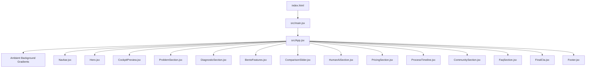

# Career GPS — System Architecture & Engineering Manual

> **Stack:** React 19 · Vite 7 · Vanilla CSS Design System · Pure React Hooks  
> **Philosophy:** Zero legacy DOM dependencies, maximum performance, modular components.

---

## 1. Project Directory Structure

```text
referso clone/
├── docs/                        # Complete project documentation hub
│   ├── design.md                # Design tokens, color system, and UI guidelines
│   ├── architecture.md          # React component tree and state architecture (this file)
│   ├── seo-and-geo.md           # Google schemas (JSON-LD) and AI crawler optimization
│   ├── components-guide.md      # Individual component developer guide
│   └── skill.md                 # Antigravity design-system skill specification
├── public/                      # Static public assets (favicons, images)
│   └── crafture-logo.jpg        # 3D Brand Mark icon
├── src/
│   ├── components/              # 14 Modular React sections
│   │   ├── Navbar.jsx           # Fixed capsule navigation + scroll spy + mobile drawer
│   │   ├── Hero.jsx             # Hero headline + dynamic rotating keyword cycler
│   │   ├── CockpitPreview.jsx   # Interactive cockpit dashboard + live terminal + ATS ring
│   │   ├── ProblemSection.jsx   # 6-card friction bento grid + Cost of Delay matrix
│   │   ├── DiagnosticSection.jsx# 3D concentric orbital dials + 5 dimension cards
│   │   ├── BentoFeatures.jsx    # 8-agent autonomous fleet bento grid
│   │   ├── ComparisonSlider.jsx # Draggable Before/After comparison slider (pure React)
│   │   ├── HumanAiSection.jsx   # Dual-pillar strategy + 5-column competitive matrix
│   │   ├── PricingSection.jsx   # Monthly/Annual dynamic price calculator ($150 / $300)
│   │   ├── ProcessTimeline.jsx  # Chronological 4-phase career acceleration roadmap
│   │   ├── CommunitySection.jsx # Placement statistics (1,200+ placed) & verified reviews
│   │   ├── FaqSection.jsx       # Accessible expanding/collapsing FAQ accordion
│   │   ├── FinalCta.jsx         # Bottom conversion banner with shimmering action button
│   │   └── Footer.jsx           # Semantic footer with sitemap and brand identity
│   ├── App.jsx                  # Main application orchestrator
│   ├── index.css                # Pure CSS design system (tokens, utilities, layouts)
│   └── main.jsx                 # React 19 root DOM mount
├── index.html                   # HTML5 SPA shell + JSON-LD SEO structured schemas
├── package.json                 # Dependencies and scripts
├── vite.config.js               # Vite bundler configuration
└── README.md                    # Project overview and quickstart guide
```

---

## 2. Component Hierarchy & Flow



---

## 3. Interactive React Hooks & State Mechanics

Every interactive widget operates natively with React hooks without touching global `document.querySelector` or external scripts:

### 3.1 Live Terminal Agent Logger ([`CockpitPreview.jsx`](file:///c:/Users/hp/Desktop/ADITYA/exp/referso%20clone/src/components/CockpitPreview.jsx))

- **State:** `logs` array initialized with initial system events.
- **Hook:** `useEffect` with an interval running every 2.4s. It simulates incoming real-time job scraping and ATS tailoring messages from the 8 autonomous agents.
- **Performance:** Automatically caps array size to prevent memory bloat, scrolling dynamically within the terminal window.

### 3.2 Dynamic Rotating Keyword Cycler ([`Hero.jsx`](file:///c:/Users/hp/Desktop/ADITYA/exp/referso%20clone/src/components/Hero.jsx))

- **State:** `currentKeywordIndex` (`0` to `3`).
- **Hook:** `useEffect` cycles through keywords every 2.8s:
  1. `prep interviews`
  2. `ship code`
  3. `work your day job`
  4. `relax and sleep`
- **Animation:** CSS transition fades out and slides in each keyword smoothly.

### 3.3 Draggable Before/After Physics ([`ComparisonSlider.jsx`](file:///c:/Users/hp/Desktop/ADITYA/exp/referso%20clone/src/components/ComparisonSlider.jsx))

- **State:** `sliderPos` (`50` default percentage) and `isDragging` boolean.
- **Ref:** `sliderRef` attaches directly to the container DOM element.
- **Listeners:**
  - Pointer/Mouse: `onMouseDown`, `onMouseMove`, `onMouseUp` bound to `window` during active drag.
  - Touch: `onTouchMove` calculates touch coordinates relative to container width.
- **Visuals:** Dynamically binds `left: ${sliderPos}%` to the handle and `width: ${sliderPos}%` to the overlay clip container.

### 3.4 Dynamic Pricing Calculator ([`PricingSection.jsx`](file:///c:/Users/hp/Desktop/ADITYA/exp/referso%20clone/src/components/PricingSection.jsx))

- **State:** `isAnnual` boolean.
- **Behavior:**
  - When `isAnnual` is `true`:
    - Career GPS AI plan displays **$120 / month** (billed annually, saves $360/yr).
    - Elite AI + Human plan displays **$240 / month** (billed annually, saves $720/yr).
  - When `isAnnual` is `false`:
    - Displays standard month-to-month prices ($150 and $300).
- **Accessibility:** Toggle switch uses `<button role="switch" aria-checked={isAnnual}>`.

### 3.5 Expandable FAQ Accordion ([`FaqSection.jsx`](file:///c:/Users/hp/Desktop/ADITYA/exp/referso%20clone/src/components/FaqSection.jsx))

- **State:** `activeIndex` (number or `null`).
- **Behavior:** Clicking an FAQ question expands its detailed answer with smooth CSS `grid-template-rows` transition while toggling previous panels.
- **Accessibility:** Fully supports `aria-expanded` and keyboard navigation via Space / Enter.

### 3.6 Floating Navbar & Scroll Spy ([`Navbar.jsx`](file:///c:/Users/hp/Desktop/ADITYA/exp/referso%20clone/src/components/Navbar.jsx))

- **State:** `isScrolled` boolean and `mobileMenuOpen` boolean.
- **Hook:** Passive `window.addEventListener('scroll')` adds `.scrolled` glass shadow once user scrolls past 30px.
- **Mobile Menu:** Renders an animated backdrop drawer when screen width drops below 768px.

---

## 4. Build Pipeline & Performance

- **Bundler:** Vite 7 (esbuild for ultra-fast HMR and Rollup for production chunking).
- **Build Command:** `npm run build`
- **Output:** Built to `dist/`:
  - `dist/index.html` (8.35 kB)
  - `dist/assets/index-[hash].css` (37.94 kB minified)
  - `dist/assets/index-[hash].js` (280 kB minified and tree-shaken)
- **Zero Runtime Overhead:** No heavy animation frameworks (e.g. Framer Motion, GSAP) required; 100% of fluid animations are handled by GPU-accelerated CSS keyframes (`transform: translate3d()` and `opacity`).
